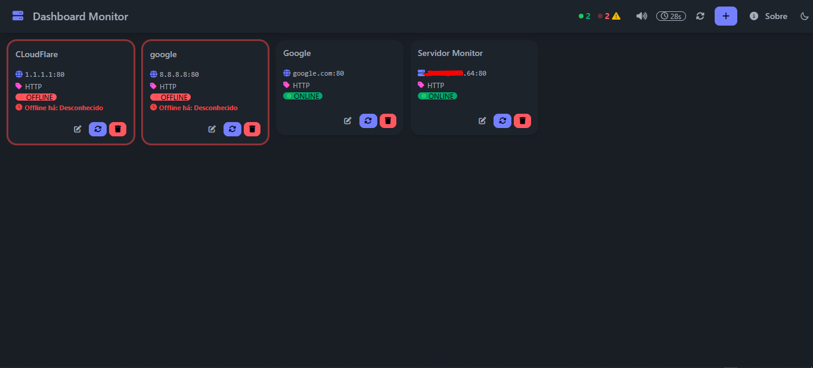
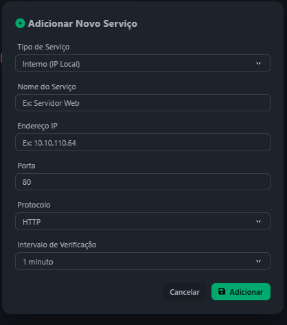
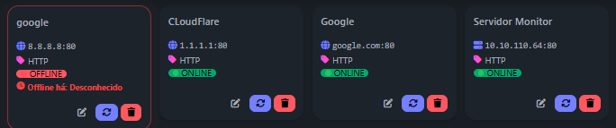
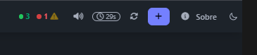

# Service Monitor Dashboard

Sistema web de monitoramento de serviços em tempo real com alertas sonoros e interface responsiva

## Visão Geral

Um dashboard completo para monitoramento de infraestrutura que permite acompanhar o status de serviços internos e externos em tempo real. Desenvolvido em PHP com interface moderna usando DaisyUI/TailwindCSS, oferece verificação automática de conectividade, alertas sonoros para falhas e gestão visual intuitiva de todos os seus serviços críticos.

## Funcionalidades Principais

### Monitoramento em Tempo Real
- Auto-refresh configurável (30s, 1min, 5min, 10min, 30min, 1h)
- Verificação individual ou em lote de serviços
- Timer visual com countdown até próxima atualização
- Detecção imediata de mudanças de status

### Sistema de Alertas
- Alertas sonoros para novos serviços offline
- Indicadores visuais com animação de pulso para falhas
- Lembretes periódicos a cada 30 minutos
- Toggle para ativar/desativar notificações sonoras
- Suporte a múltiplos formatos de áudio (MP3, WAV, Web Audio API)

### Interface Responsiva
- Grid dinâmico que se adapta à resolução da tela
- Tema claro/escuro com persistência local
- Cards compactos com informações essenciais
- Compatível com desktop, tablet e mobile
- Atalhos de teclado para maior produtividade

### Gestão de Serviços
- Adição via modal intuitivo
- Edição in-line de configurações
- Exclusão com confirmação de segurança
- Suporte a serviços internos (IP local) e externos (domínio/IP público)

### Protocolos Suportados
- HTTP/HTTPS
- MySQL
- SSH
- FTP
- DNS
- SMTP
- Protocolos personalizados

## Screenshots

### Dashboard Principal
Interface principal mostrando serviços online e offline com contadores em tempo real.

### Modal de Configuração
Sistema de adição e edição de serviços com campos adaptativos.

### Alertas Visuais
Indicadores de status com animações para serviços offline.


## Requisitos

- PHP 7.4 ou superior
- MySQL 5.7 ou superior
- Apache/Nginx com mod_rewrite
- Navegador moderno com suporte a JavaScript ES6+

## Instalação

1. Clone o repositório:
```bash
git clone https://github.com/seu-usuario/service-monitor-dashboard.git
cd service-monitor-dashboard
```

2. Configure o banco de dados:
```sql
CREATE DATABASE service_monitor;
```

3. Importe a estrutura do banco:
```bash
mysql -u usuario -p service_monitor < database/structure.sql
```

4. Configure as credenciais:
```php
// includes/config.php
define('DB_HOST', 'localhost');
define('DB_USER', 'seu_usuario');
define('DB_PASS', 'sua_senha');
define('DB_NAME', 'service_monitor');
define('SITE_NAME', 'Monitor de Serviços');
define('AUTO_REFRESH', 30); // segundos
```

5. Configure as permissões:
```bash
chmod 755 includes/
chmod 644 includes/config.php
```

6. Acesse via navegador:
```
http://localhost/service-monitor-dashboard
```

## Configuração

### Arquivo de Configuração
Edite `includes/config.php` para personalizar:
- Credenciais do banco de dados
- Nome do site
- Intervalo de auto-refresh padrão
- Configurações de timeout

### Estrutura do Banco
O sistema cria automaticamente as tabelas:
- `internal_services`: Serviços da rede interna
- `external_services`: Serviços externos/internet

## Uso

### Adicionando Serviços
1. Clique no botão "+" no canto superior direito
2. Selecione o tipo (Interno ou Externo)
3. Preencha os dados do serviço
4. Configure o intervalo de verificação
5. Clique em "Adicionar"

### Monitoramento
- Serviços offline aparecem primeiro na listagem
- Cards offline pulsam em vermelho
- Contadores de status são atualizados automaticamente
- Timer offline é atualizado a cada segundo

### Alertas Sonoros
- Ative/desative via botão de som no cabeçalho
- Sons tocam automaticamente para novos serviços offline
- Alertas periódicos para lembretes de falhas persistentes

## Atalhos de Teclado

- `Ctrl/Cmd + N`: Adicionar novo serviço
- `Ctrl/Cmd + R`: Recarregar página
- `Ctrl/Cmd + S`: Toggle de som

## API Endpoints

O sistema inclui API RESTful para operações:

```
GET  /api/check_service.php?id={id}&type={type}
POST /api/add_service.php
PUT  /api/update_service.php
DELETE /api/delete_service.php
GET  /api/get_service.php?id={id}&type={type}
```

## Estrutura do Projeto

```
service-monitor-dashboard/
├── index.php              # Página principal
├── about.php              # Página sobre
├── includes/
│   └── config.php         # Configurações
├── api/
│   ├── check_service.php  # Verificação de serviço
│   ├── add_service.php    # Adicionar serviço
│   ├── update_service.php # Atualizar serviço
│   ├── delete_service.php # Remover serviço
│   └── get_service.php    # Obter dados do serviço
├── assets/
│   └── alert.mp3         # Som de alerta
└── database/
    └── structure.sql     # Estrutura do banco
```

## Personalização

### Temas
O sistema suporta temas do DaisyUI. Para adicionar novos temas:
1. Edite o atributo `data-theme` no HTML
2. Configure a lista de temas no JavaScript
3. Adicione estilos CSS customizados se necessário

### Intervalos de Verificação
Modifique os intervalos disponíveis editando o select no modal:
```html
<option value="30">30 segundos</option>
<option value="60">1 minuto</option>
<!-- Adicione mais opções -->
```

### Protocolos
Para adicionar novos protocolos, edite:
1. Select de protocolo no modal
2. Lógica de verificação na API
3. Ícones correspondentes no CSS

## Solução de Problemas

### Serviços não são verificados
- Verifique conectividade de rede
- Confirme se as portas estão abertas
- Verifique logs do PHP para erros

### Alertas sonoros não funcionam
- Verifique se o navegador permite autoplay
- Teste com interação do usuário primeiro
- Verifique console do navegador para erros

### Interface não carrega
- Confirme configuração do banco de dados
- Verifique permissões de arquivo
- Analise logs do servidor web

## Contribuição

1. Fork o projeto
2. Crie uma branch para sua feature (`git checkout -b feature/nova-funcionalidade`)
3. Commit suas mudanças (`git commit -am 'Adiciona nova funcionalidade'`)
4. Push para a branch (`git push origin feature/nova-funcionalidade`)
5. Abra um Pull Request

## Licença

Este projeto está licenciado sob a MIT License - veja o arquivo [LICENSE](LICENSE) para detalhes.

## Suporte

Para suporte e dúvidas:
- Abra uma [Issue](https://github.com/seu-usuario/service-monitor-dashboard/issues)
- Verifique a [Wiki](https://github.com/seu-usuario/service-monitor-dashboard/wiki) para documentação adicional

## Changelog

### v1.0.0
- Lançamento inicial
- Monitoramento de serviços internos e externos
- Interface responsiva
- Sistema de alertas sonoros
- Tema claro/escuro
- API RESTful completa
